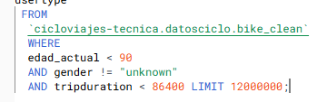

# Proyecto Ciclo Viajes

>[ Detalles del proyecto](proyecto.md)

## Datos esperados:
1 - Métricas de uso de un día promedio
* Número de viajes que se realizan en promedio
* Max, min, promedio, desviación estándar (opcional) de la duración de un viaje

2 - Métricas históricas
* Total de viajes
* Crecimiento del número de viajes diarios a lo largo del tiempo (opcional)
* Total de viajes por usuarios, según género, edad y/o tipo de suscripción

## Preguntas planteadas:
* ¿Qué conclusiones generales puedes sacar? 
* ¿Qué patrones o ideas descubriste? 
* ¿Alguna recomendación para el nuevo CEO?

---

> Variables del [dataset](https://console.cloud.google.com/marketplace/product/city-of-new-york/nyc-citi-bike?project=data-sandbox-319716).

| Conteo | Nombre del campo           | Tipo      | Nullable |
|--------|----------------------------|-----------|----------|
| 0      | tripduration   (Segundos)            | INTEGER   | SI       |
| 1      | starttime                  | TIMESTAMP | SI       |
| 2      | stoptime                    | TIMESTAMP | SI       |
| 3      | start_station_id            | INTEGER   | SI       |
| 4      | start_station_name          | STRING    | SI       |
| 5      | start_station_latitude      | FLOAT     | SI       |
| 6      | start_station_longitude     | FLOAT     | SI       |
| 7      | end_station_id              | INTEGER   | SI       |
| 8      | end_station_name            | STRING    | SI       |
| 9      | end_station_latitude        | FLOAT     | SI       |
| 10     | end_station_longitude       | FLOAT     | SI       |
| 11     | bikeid                      | INTEGER   | SI       |
| 12     | usertype                    | STRING    | SI       |
| 13     | birth_year                  | INTEGER   | SI       |
| 14     | gender                      | STRING    | SI       |
| 15     | customer_plan               | STRING    | SI       |
| | | | 

 

## Detalle de tareas y consultas SQL
 

| Tarea | Resultados           | Query      | 
|--------|----------------------------|-----------|
| Identificación de Nulos | Existen de 5.828.994 hasta 11.403.385, donde se decide dejar todos los nulos por fuera del estudio. | [Identificación](SQL\conteo_nulos.sql) de nulos y [exclusión](SQL\exclusion_nulos.sql) de nulos|
| Identificación de duplicados| Posterior a la limpieza de nulos, los datos totales fueron: 47.534.330, se exploró la eliminación de duplicados donde la unión de bikeid, starttime y stoptime no coincidiera. Dando como resultado 47.534.325 datos (solo 5 duplicados con las condiciones dadas) | [Exploración](SQL\exploracion_duplicados.sql) duplicados |
| Analizar las variables con las que se va a trabajar y cambiar los datos según sea necesario| Se decide dejar por duera del estudio las siguientes variables: start_station_latitude, start_station_longitude, end_station_latitude, end_station_longitude, customer_plan      | [Consulta](SQL\cambio_datos.sql) de cambios de datos |
| Clausulas Where | Por el peso y las limitaciones propias del uso gratuito se decide dejar por fuera, datos como: viajes mayores a 24 horas, personas con género desconocido y edad mayores a 90 años, obteniendo 46.949.571 resultados | [Query](SQL\clausulas_where.sql) |
| Limite de datos | Debido a las limitaciones propias de la versión gratuita y la publicación en Tableau Public, se limitaron las filas a 12.000.000 de datos. | |
| | | |

 

## Creación de tablero

[Link](https://public.tableau.com/app/profile/osiris.berbesia/viz/dashboard_17238310552130/Dashboard?publish=yes)
 

 

## Enlaces relevantes

[City Bike](https://citibikenyc.com/homepage)
 

## Respuestas
1.  Métricas de uso de un día promedio:

-   Número de viajes que se realizan en promedio:
 Para "hombres y mujeres", el total es 12,000,000 viajes. 
 >Asumiendo que esto cubre un año, el promedio diario sería aproximadamente 32,877 viajes.
-   Duración de un viaje:
    -   Promedio: 15.8 minutos (mostrado en el dashboard, con las demás tendencias)

2.  Métricas históricas:

-   Total de viajes: 12,000,000 (para "hombres y mujeres")
-   Total de viajes por usuarios:
    -   Por género: 
        - Hombres: 9,012,620
        - Mujeres: 2,987,380
    -   Por tipo de suscripción: 
        - Cliente: 82,281
        - Suscrito: 11,907,719

### Generalidades

1.  Predominancia masculina: Aproximadamente el 75% de los viajes son realizados por hombres.
2.  Patrones semanales: El uso es más alto durante los días laborables que en los fines de semana.
3.  Duración de viajes: La duración promedio de 15.8 minutos sugiere que muchos viajes son relativamente cortos, posiblemente para desplazamientos al trabajo o trayectos urbanos breves.
4.  Distribución por edad: Parece haber una concentración de usuarios en el rango de edad de 20 a 40 años, basándome en el gráfico de barras de edad.
5.  El grupo más numeroso es el de 30-40 años, con aproximadamente 502,459 usuarios.
6.  Segundo grupo más grande: Los usuarios de 40-50 años, con cerca de 642,576 usuarios.
7.  Tendencia general: Hay un aumento significativo desde los 20 años hasta el pico en los 30-40, seguido de una disminución gradual en los grupos de mayor edad.
8.  Grupos de edad avanzada: Hay una presencia notable de usuarios en grupos de edad avanzada, aunque en menor cantidad. Por ejemplo, aún hay 14,799 usuarios en el grupo de 80-90 años.
9.  Grupos más jóvenes: El grupo de 20-30 años muestra una participación considerable, pero menor que los grupos de 30-40 y 40-50.

Recomendaciones para la nueva CEO:

1.  Enfocarse en aumentar la participación femenina, ya que representan una minoría significativa de los usuarios actuales.
2.  Considerar estrategias para mantener el uso durante los meses de invierno, cuando hay una clara disminución.
3.  Explorar oportunidades para aumentar el uso durante los fines de semana, posiblemente mediante promociones o alianzas con eventos locales.
4.  Analizar más a fondo los patrones de uso por edad para orientar mejor las campañas de marketing y la expansión del servicio.
5.  Investigar por qué la duración promedio de los viajes es de 15.8 minutos y considerar si se pueden implementar estrategias para fomentar viajes más largos o frecuentes.
6. Evaluar que está sucediendo con los viajes extremadamente breves y extremadamente largos, si es un error en el registro de los datos, o si son viajes que no se han terminado a tiempo en el sistema, o si los usuarios están usando las bicicletas como medio de transporte personal en periodos largos de tiempo.
7. Orientar estrategias de marketing hacia los grupos de edad más activos.
8. Identificar oportunidades para aumentar la participación en grupos de edad menos representados.
9. Adaptar el servicio para satisfacer las necesidades de diferentes grupos etarios.
10. Planificar expansiones o modificaciones del servicio basadas en las preferencias de edad de los usuarios actuales.

